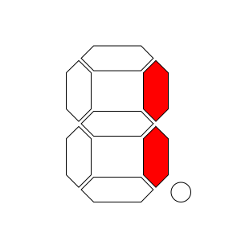
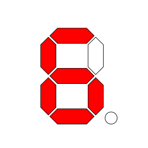
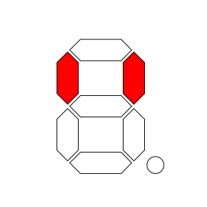
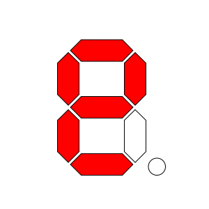
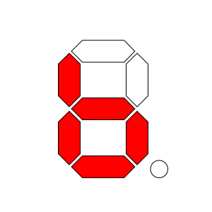
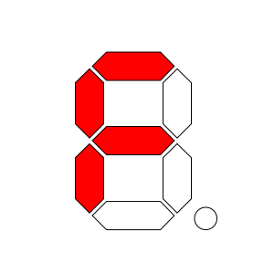
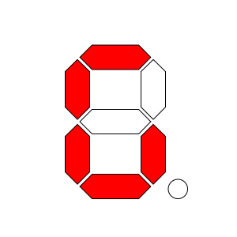
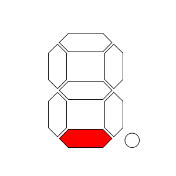

7-Segment Display
=========================

.. seo::
    :description: Instructions for setting up 7-segment displays without driver ic.
    :image: sevenseg.jpg

The ``sevenseg`` display platform allows you to use a generic 7-segment display without driver ic like the (
`3641AS <http://www.xlitx.com/datasheet/3641AS.pdf>`__)
with ESPHome. This component is a bit more low-level than the other display components and requires you to
manually specify the pins for each segment and digit. This component is useful if you have a 7-segment display
without a driver ic and want to control it directly.

.. figure:: https://upload.wikimedia.org/wikipedia/commons/thumb/a/a5/LED_Digital_Display.jpg/1605px-LED_Digital_Display.jpg
    :align: center
    :width: 75.0%

    `7-Segment Display. <https://en.wikipedia.org/wiki/Seven-segment_display>`__

.. list-table::
   :widths: 50 50
   :header-rows: 0

   * - .. figure:: https://upload.wikimedia.org/wikipedia/commons/a/a4/7segment_multiplexing.gif
        :width: 100%
        :alt: 7 Segment Multiplexing

     - .. figure:: https://upload.wikimedia.org/wikipedia/commons/e/ed/7_Segment_Display_with_Labeled_Segments.svg
        :width: 100%
        :alt: 7 Segment Display with Labeled Segments

.. code-block:: yaml

    # Example configuration entry
    display:

  - platform: sevenseg
    id: test
    lambda: |-
      it.print("1234");

    a_pin: GPIO1
    b_pin: GPIO2
    c_pin: GPIO3
    d_pin: GPIO4
    e_pin: GPIO5
    f_pin: GPIO6
    g_pin: GPIO7
    dp_pin: GPIO8

    digits:
      - GPIO9
      - GPI10
      - GPI11
      - GPI12
    # - ...

Configuration variables:
------------------------

- **a_pin** (**Required**, :ref:`Pin Schema <config-pin_schema>`): The pin you have the A line hooked up to.
- **b_pin** (**Required**, :ref:`Pin Schema <config-pin_schema>`): The pin you have the B line hooked up to.
- **c_pin** (**Required**, :ref:`Pin Schema <config-pin_schema>`): The pin you have the C line hooked up to.
- **d_pin** (**Required**, :ref:`Pin Schema <config-pin_schema>`): The pin you have the D line hooked up to.
- **e_pin** (**Required**, :ref:`Pin Schema <config-pin_schema>`): The pin you have the E line hooked up to.
- **f_pin** (**Required**, :ref:`Pin Schema <config-pin_schema>`): The pin you have the F line hooked up to.
- **g_pin** (**Required**, :ref:`Pin Schema <config-pin_schema>`): The pin you have the G line hooked up to.
- **dp_pin** (**Required**, :ref:`Pin Schema <config-pin_schema>`): The pin you have the DP line hooked up to.
- **digits** (**Required**, :ref:`Pin Schema <config-pin_schema>`): The number of chips you wish to use for daisy chaining. Defaults to
- **lambda** (*Optional*, :ref:`lambda <config-lambda>`): The lambda to use for rendering the content on the sevensegment.
  See :ref:`display-sevenseg_lambda` for more information.
- **update_interval** (*Optional*, :ref:`config-time`): The interval to re-draw the screen. Defaults to ``25ms``.
- **id** (*Optional*, :ref:`config-id`): Manually specify the ID used for code generation.

.. _display-sevenseg_lambda:

Rendering Lambda
----------------

The sevenseg has a similar API to the fully fledged :ref:`display-engine`, but it's only a subset as the
7-segment displays don't have a concept of individual pixels. In the lambda you're passed a variable called ``it``
as with all other displays. In this case however, ``it`` is an sevenseg instance.

The most basic operation with the sevenseg is wiring a simple number to the screen as in the configuration example
at the top of this page. But even though you're passing in a string (here ``"01234567"``), ESPHome converts it
into a representation that the sevenseg can understand: The exact pixels that should be turned on. And of course,
not all characters can be represented. You can see a full list of characters :ref:`below <display-sevenseg_characters>`.

Also note that the ``.`` (dot) character is special because when ESPHome encounters it in the string the dot
segment of the previous position will be enabled.

Please see :ref:`display-printf` for a quick introduction into the ``printf`` formatting rules and
:ref:`display-strftime` for an introduction into the ``strftime`` time formatting.

.. _display-sevenseg_characters:

All 7-Segment Characters
------------------------

.. raw:: html

    <style>
        /* dark theme */
        @media (prefers-color-scheme: dark) {
            #all-7-segment-characters img {
                background-color: #6b6b6b;
            }
        }
    </style>

============================== ==============================
**Sevenseg Representation**     **Character**
------------------------------ ------------------------------
|sevenseg00|                    *(space)*
------------------------------ ------------------------------
|sevenseg80|                    ``.``
------------------------------ ------------------------------
|sevensegB0|                    ``!``
------------------------------ ------------------------------
|sevenseg7E|                    ``0``, ``O``
------------------------------ ------------------------------
|sevenseg30|                    ``1``, ``I``
------------------------------ ------------------------------
|sevenseg6D|                    ``2``, ``Z``
------------------------------ ------------------------------
|sevenseg79|                    ``3``
------------------------------ ------------------------------
|sevenseg33|                    ``4``
------------------------------ ------------------------------
|sevenseg5B|                    ``5``, ``S``, ``s``
------------------------------ ------------------------------
|sevenseg5F|                    ``6``
------------------------------ ------------------------------
|sevenseg70|                    ``7``
------------------------------ ------------------------------
|sevenseg7F|                    ``8``
------------------------------ ------------------------------
|sevenseg73|                    ``9``
------------------------------ ------------------------------
|sevenseg37|                    ``H``
------------------------------ ------------------------------
|sevenseg4E|                    ``(``, ``[``, ``C``
------------------------------ ------------------------------
|sevenseg31|                    ``{``
------------------------------ ------------------------------
|sevenseg78|                    ``)``, ``]``
------------------------------ ------------------------------
|sevenseg07|                    ``}``, ``T``, ``t``
------------------------------ ------------------------------
|sevenseg20|                    ``\```
------------------------------ ------------------------------
|sevenseg02|                    ``'``
------------------------------ ------------------------------
|sevenseg22|                    ``"``
------------------------------ ------------------------------
|sevenseg6F|                    ``@``
------------------------------ ------------------------------
|sevenseg65|                    ``?``
------------------------------ ------------------------------
|sevenseg10|                    ``,``, ``i``
------------------------------ ------------------------------
|sevenseg49|                    ``%``
------------------------------ ------------------------------
|sevenseg40|                    ``*``
------------------------------ ------------------------------
|sevenseg48|                    ``:``
------------------------------ ------------------------------
|sevenseg58|                    ``;``
------------------------------ ------------------------------
|sevenseg77|                    ``A``, ``a``
------------------------------ ------------------------------
|sevenseg1F|                    ``B``, ``b``
------------------------------ ------------------------------
|sevenseg3D|                    ``D``, ``d``
------------------------------ ------------------------------
|sevenseg4F|                    ``E``, ``e``
------------------------------ ------------------------------
|sevenseg47|                    ``F``, ``f``
------------------------------ ------------------------------
|sevenseg5E|                    ``G``, ``g``
------------------------------ ------------------------------
|sevenseg3C|                    ``J``, ``j``
------------------------------ ------------------------------
|sevenseg0E|                    ``L``, ``l``
------------------------------ ------------------------------
|sevenseg15|                    ``N``, ``n``
------------------------------ ------------------------------
|sevenseg67|                    ``P``, ``p``
------------------------------ ------------------------------
|sevensegFE|                    ``Q``
------------------------------ ------------------------------
|sevenseg05|                    ``R``, ``r``
------------------------------ ------------------------------
|sevenseg3E|                    ``U``, ``V``
------------------------------ ------------------------------
|sevenseg3F|                    ``W``
------------------------------ ------------------------------
|sevenseg27|                    ``Y``, ``y``
------------------------------ ------------------------------
|sevenseg01|                    ``-``
------------------------------ ------------------------------
|sevenseg08|                    ``_``
------------------------------ ------------------------------
|sevenseg09|                    ``=``
------------------------------ ------------------------------
|sevenseg06|                    ``|``
------------------------------ ------------------------------
|sevenseg0D|                    ``c``
------------------------------ ------------------------------
|sevenseg17|                    ``h``
------------------------------ ------------------------------
|sevenseg1D|                    ``o``
------------------------------ ------------------------------
|sevenseg1C|                    ``u``, ``v``
------------------------------ ------------------------------
|sevenseg8E|                    ``~``
------------------------------ ------------------------------
|sevenseg00|                    *(every other ascii character)*
============================== ==============================

.. |sevenseg00| image:: images/sevenseg/seg00.svg
    :class: component-image segment
.. |sevenseg80| image:: images/sevenseg/seg80.svg
    :class: component-image segment
.. |sevensegB0| image:: images/sevenseg/segB0.svg
    :class: component-image segment
.. |sevenseg7E| image:: images/sevenseg/seg7E.svg
    :class: component-image segment

.. |sevenseg6D| image:: images/sevenseg/seg6D.svg
    :class: component-image segment
.. |sevenseg79| image:: images/sevenseg/seg79.svg
    :class: component-image segment



.. |sevenseg70| image:: images/sevenseg/seg70.svg
    :class: component-image segment
.. |sevenseg7F| image:: images/sevenseg/seg7F.svg
    :class: component-image segment
.. |sevenseg73| image:: images/sevenseg/seg73.svg
    :class: component-image segment
.. |sevenseg37| image:: images/sevenseg/seg37.svg
    :class: component-image segment
.. |sevenseg4E| image:: images/sevenseg/seg4E.svg
    :class: component-image segment

.. |sevenseg78| image:: images/sevenseg/seg78.svg
    :class: component-image segment
.. |sevenseg07| image:: images/sevenseg/seg07.svg
    :class: component-image segment
.. |sevenseg20| image:: images/sevenseg/seg20.svg
    :class: component-image segment
.. |sevenseg02| image:: images/sevenseg/seg02.svg
    :class: component-image segment


.. |sevenseg65| image:: images/sevenseg/seg65.svg
    :class: component-image segment
.. |sevenseg10| image:: images/sevenseg/seg10.svg
    :class: component-image segment
.. |sevenseg49| image:: images/sevenseg/seg49.svg
    :class: component-image segment
.. |sevenseg40| image:: images/sevenseg/seg40.svg
    :class: component-image segment
.. |sevenseg48| image:: images/sevenseg/seg48.svg
    :class: component-image segment
.. |sevenseg58| image:: images/sevenseg/seg58.svg
    :class: component-image segment
.. |sevenseg77| image:: images/sevenseg/seg77.svg
    :class: component-image segment

.. |sevenseg3D| image:: images/sevenseg/seg3D.svg
    :class: component-image segment




.. |sevenseg0E| image:: images/sevenseg/seg0E.svg
    :class: component-image segment
.. |sevenseg15| image:: images/sevenseg/seg15.svg
    :class: component-image segment
.. |sevenseg67| image:: images/sevenseg/seg67.svg
    :class: component-image segment
.. |sevensegFE| image:: images/sevenseg/segFE.svg
    :class: component-image segment
.. |sevenseg05| image:: images/sevenseg/seg05.svg
    :class: component-image segment
.. |sevenseg3E| image:: images/sevenseg/seg3E.svg
    :class: component-image segment
.. |sevenseg3F| image:: images/sevenseg/seg3F.svg
    :class: component-image segment

.. |sevenseg01| image:: images/sevenseg/seg01.svg
    :class: component-image segment

.. |sevenseg09| image:: images/sevenseg/seg09.svg
    :class: component-image segment


.. |sevenseg17| image:: images/sevenseg/seg17.svg
    :class: component-image segment
.. |sevenseg1D| image:: images/sevenseg/seg1D.svg
    :class: component-image segment
.. |sevenseg1C| image:: images/sevenseg/seg1C.svg
    :class: component-image segment
.. |sevenseg8E| image:: images/sevenseg/seg8E.svg
    :class: component-image segment

.. note::
    A lot of this code and documentation was inspired/provided by the MAX7219 component.
    Original 7-segment display base image taken from Wikipedia at https://de.wikipedia.org/wiki/Datei:7_Segment_Display.svg
    by user `h2g2bob <https://commons.wikimedia.org/wiki/User:H2g2bob>`__ under
    `Creative Commons BY-SA 3.0 <https://creativecommons.org/licenses/by-sa/3.0/deed.de>`__ and modified
    for this documentation.

See Also
--------

- :doc:`index`
- :apiref:`sevenseg/sevenseg.h`
- `Wikipedia: Seven-segment display <https://en.wikipedia.org/wiki/Seven-segment_display>`__
- `3641AS Datasheet <http://www.xlitx.com/datasheet/3641AS.pdf>`__
- `YouTube implementation <https://www.youtube.com/watch?v=XKq12Ws2Iek>`__
- :ghedit:`Edit`